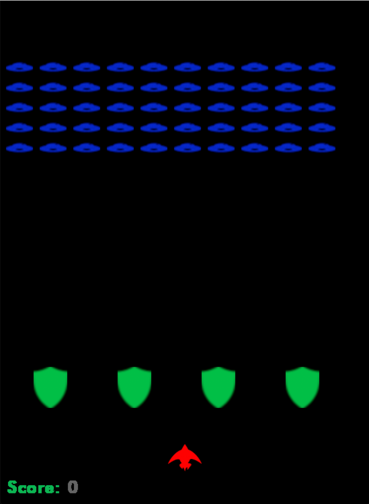

# Space Invasion clone
This game is my attempt to create a clone of the original 
Space Invasion game.  The game allows the player control a
small space ship and shoot at the various ships slowly descending
from above.  I hope to use this beginner project as a fun way to improve my coding.

The game is pretty straight forward.  The user is able to control the ship at the bottom of the screen and must destroy the alien fleet.  The user is awarded for the amount of aliens they are able to destroy and penalized for the amount of ammo they use during the course of the game. There are a total of 3 alien fleets that will invade and a special enemy that will spawn if all three alien fleets are destroyed.  The user's score will display after the game session has ended.

## Built With
[pygame](https://www.pygame.org/news) - The gaming framework used to build this game.

## Issues
  * Scoring needs to be implemented
  * Alien movement needs to be fixed
  * Game currently doesn't support window resizing
  * Barrier needs to be able to accept damage
  * Different Alien types need to be added
  * Added better images for the sprites
  * Sound needs to be added to the game
  * The user should be given 3 lives
  * Main menu should be distinct from actual game-play screen
  